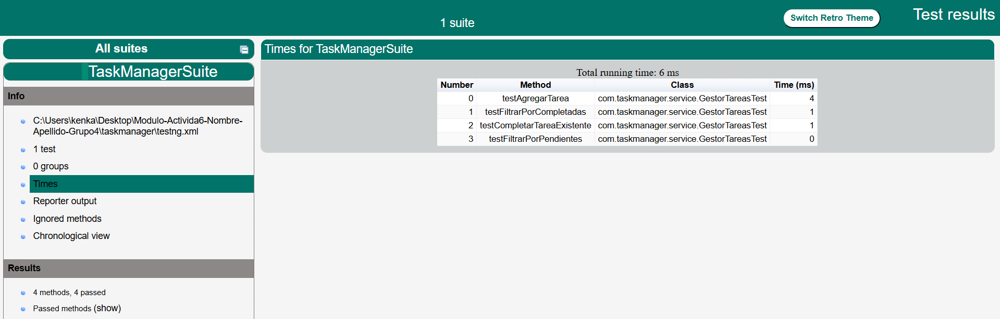

# ✅ TaskManager - Sistema de Gestión de Tareas con TestNG

Este proyecto permite gestionar tareas básicas y está orientado a prácticas de pruebas automatizadas usando **TestNG**, con pruebas parametrizadas, estructura XML, ejecución en paralelo y aserciones.

---

👨‍💻 **Autor**  
Módulo 3 - Actividad 5  
Equipo 4:  
- Fabiola Díaz  
- Felipe Lobos  
- Eduardo Arellano  
- Carlos Vásquez  

---

## 🔁 Resultados

### Resultado Final Test:  


---

## 🚀 ¿Qué hace el sistema?

- ✅ Agrega tareas con título y descripción (estado: pendiente).  
- ✅ Permite marcarlas como completadas.  
- ✅ Filtra tareas por estado (pendiente o completada).  
- ✅ Realiza pruebas automatizadas con TestNG.

---

## 🧪 ¿Qué incluye la suite de pruebas?

- ✅ Pruebas **unitarias automatizadas** con TestNG.  
- ✅ Parámetros desde archivo `testng.xml`.  
- ✅ Métodos de configuración con `@BeforeClass` y `@AfterClass`.  
- ✅ Pruebas en paralelo (`parallel="methods"`).  
- ✅ Validación de casos exitosos y fallidos.  
- ✅ Uso de aserciones `Assert` y `SoftAssert`.

---

## 📦 Dependencias (`pom.xml`)

```xml
<dependencies>
  <dependency>
    <groupId>org.testng</groupId>
    <artifactId>testng</artifactId>
    <version>7.10.1</version>
    <scope>test</scope>
  </dependency>
</dependencies>

⚒️ Configuración del archivo testng.xml

<!DOCTYPE suite SYSTEM "https://testng.org/testng-1.0.dtd">
<suite name="TaskManagerSuite" parallel="methods" thread-count="2">

  <parameter name="titulo" value="Tarea 1"/>
  <parameter name="descripcion" value="Descripción de la tarea 1"/>

  <test name="GestorTareasTest">
    <classes>
      <class name="com.taskmanager.service.GestorTareasTest"/>
    </classes>
  </test>

</suite>    


